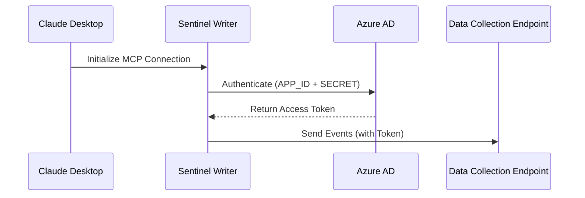
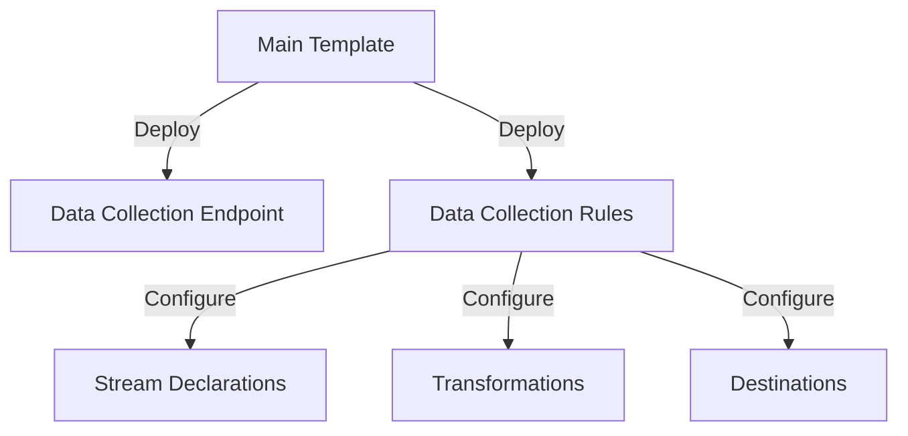

# Architecture Overview

## System Architecture

### High-Level Components

1. **Claude Desktop Application**
   
   - User interface for interaction
   - MCP server management
   - Configuration handling

2. **MCP Servers**
   
   - Sentinel Writer server
   - Brave Search server (optional for enhanced capabilities)
   - Node.js runtime environment

3. **Azure Components**
   
   - Data Collection Endpoints (DCE)
   - Data Collection Rules (DCR)
   - Microsoft Sentinel workspace
   - Azure Active Directory (authentication)

## Component Details

### 1. Authentication Flow



### 2. Data Collection Rules Structure

DCRs are organized by log type categories:

#### ASIM (Advanced Security Information Model) Logs

- Audit Events
- Authentication Events
- DHCP Events
- DNS Activity
- File Events
- Network Sessions
- Process Events
- Registry Events
- User Management
- Web Sessions

#### Cloud Provider Logs

- AWS CloudTrail
- AWS CloudWatch
- AWS GuardDuty
- AWS VPC Flow
- GCP Audit Logs
- Google Cloud SCC

#### Traditional Security Logs

- Common Security Log
- Security Event
- Syslog
- Windows Event
- Anomalies

### 3. Event Processing Pipeline


### 4. Component Communication

#### MCP Protocol Integration

The system implements the Model Context Protocol for communication between Claude Desktop and the Sentinel Writer server:

```javascript
interface MCPCommand {
    type: string;
    parameters: {
        dcrType: string;
        eventData: object;
    };
}

interface MCPResponse {
    status: 'success' | 'error';
    data?: object;
    error?: string;
}
```

#### Event Generation and Validation

Events are generated and validated according to specific DCR schemas:

```typescript
interface EventProcessor {
    validateSchema(dcrType: string, eventData: object): boolean;
    transformEvent(dcrType: string, eventData: object): object;
    sendToIngestion(event: object): Promise<void>;
}
```

### 5. Security Architecture

#### Authentication Layers

1. **Service Principal Authentication**
   
   - Azure AD application registration
   - Secret management
   - Role-based access control

2. **Data Collection Endpoint Security**
   
   - Token-based authentication
   - Request validation
   - TLS encryption

3. **Network Security**
   
   - Private endpoints support
   - IP restrictions
   - Firewall rules

### 6. Scalability Considerations

#### Performance Optimization

- Batch processing capabilities
- Rate limiting implementation
- Resource utilization monitoring

#### Error Handling

```typescript
interface ErrorHandler {
    retryStrategy: RetryConfig;
    errorMapping: Map<string, ErrorResponse>;
    backoffPolicy: BackoffPolicy;
}

interface RetryConfig {
    maxRetries: number;
    initialDelay: number;
    maxDelay: number;
}
```

## Infrastructure as Code

### Bicep Template Structure

```plaintext
infrastructure/
├── main.bicep                 # Main deployment template
├── parameters.json            # Parameter definitions
├── DCR-Anomalies.bicep        # Anomalies DCR
├── DCR-ASimAuditEventLogs.bicep
├── DCR-ASimAuthenticationEventLogs.bicep
└── [Additional DCR templates]
```

### Resource Deployment Flow



## System Requirements

### Minimum Requirements

- Windows Operating System
- Node.js 14.x or higher
- 4GB RAM minimum
- Azure Subscription
- Microsoft Sentinel workspace

### Recommended Configuration

- Windows 10/11 Professional or Enterprise
- Node.js 16.x or higher
- 8GB RAM or higher
- Dedicated service principal
- Private endpoint connectivity

## Monitoring and Maintenance

### Health Monitoring

- Server status checks
- Event processing metrics
- Error rate monitoring
- Performance metrics

### Maintenance Tasks

1. Regular updates
   
   - Node.js version
   - MCP server components
   - Azure resource configurations

2. Security maintenance
   
   - Credential rotation
   - Security patch application
   - Access review

## Future Architecture Considerations

### Planned Enhancements

1. Additional log type support
2. Enhanced batching capabilities
3. Advanced retry mechanisms
4. Extended monitoring capabilities

### Scalability Improvements

1. Load balancing support
2. Multi-region deployment
3. Enhanced caching mechanisms
4. Performance optimizations

## Integration Points

### External Systems

1. Microsoft Sentinel
2. Azure Monitor
3. Cloud Provider APIs
4. Custom log sources

### API Interfaces

1. MCP Protocol API
2. Azure Management API
3. DCE Ingestion API
4. Monitoring APIs